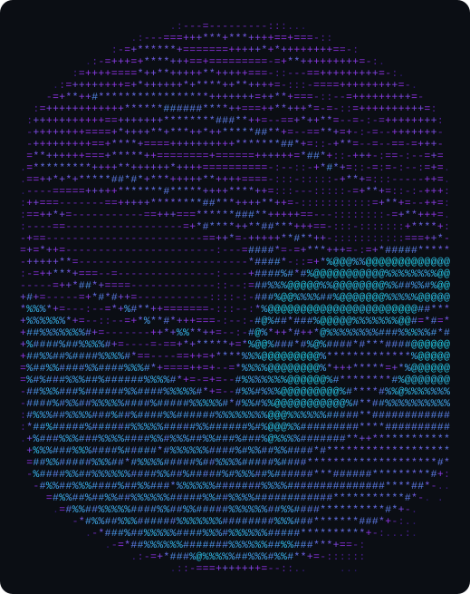
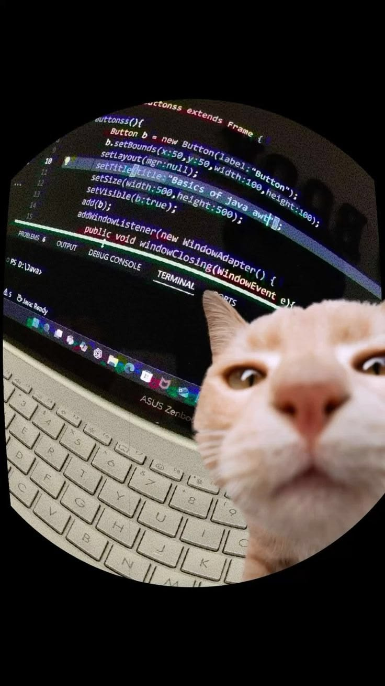

<table>
<tr>
<td width="270" align="center">

</td>
<td>

Final-Year B.Tech, Computer Engineering — PCCoE, Pune
Full-Stack & GenAI Developer
Co-Treasurer, ACM Student Chapter PCCoE

</td>
</tr>
</table>

 

## About

- Currently building full-stack, AI-native apps — Antigravity, Cursor, and GitHub Copilot are part of the everyday workflow
- Currently exploring GenAI / RAG pipelines and cloud-native architecture on AWS
- Shipped a copyright-registered app, a published research paper, and an award-winning chapter website
- Ask me about React/Next.js, AWS, RAG systems, or surviving back-to-back FA deadlines

real footage of my last debugging session

 

 

## Tech Stack

AI-assisted dev workflow: Antigravity · Cursor · GitHub Copilot · Groq / LLaMA · OpenRouter

 

## Featured Projects

| Project | Stack | What it does |
|---|---|---|
| **[AgriTrade — Agro Product App](#)**  Copyright Registered · Published, AICCoNS 2025 | AI/ML, Recommendation Systems | Smart e-commerce marketplace for farmers with real-time mandi price tracking, weather intelligence, and an AI-driven recommendation engine. |
| **[ExamSense AI](#)** | Next.js 14, TypeScript, FastAPI, MongoDB | Full-stack academic intelligence platform — JWT role auth, PDF ingestion pipeline, a RAG-based Ask-AI chat, and a topic/difficulty analytics dashboard. |
| **[PortfolioCloud](#)** | AWS (EC2, S3, DynamoDB, VPC, CloudWatch), Node.js | Cloud-native portfolio builder on raw AWS infra with an AI bio generator and a full admin panel. |
| **[VaultGuard](https://github.com/SwayamMandhani06/VaultGuard)** | React, Vite, Tailwind, Node.js, Groq/LLaMA 3 | GenAI fraud-detection dashboard with RAG-style suspicious-activity report generation and an analyst feedback loop. |
| **[NexVerse AI](#)** | Next.js 14, Three.js, Groq, Web Audio API | Immersive 3D UI/UX experiment with real-time audio visualization and a webcam-based emotion detector. |
| **[ReqGuard](#)** | Groq + Ollama, NLP | AI-assisted requirement-conflict detector for SRS docs — flags contradictions and auto-generates Mermaid diagrams. |
| **[Habit Tracker](https://github.com/SwayamMandhani06/Habit-Tracker)** · [Live](https://habit-tracker-swayam.vercel.app/pin?from=%2F) | Next.js, React, Tailwind, MongoDB, PWA | Offline-first Progressive Web App for habit tracking with streaks and monthly analytics. |
| **[JourneyHub](https://github.com/SwayamMandhani06/JourneyHub)** | Node.js, Express, MongoDB | Full-stack travel agency booking platform. |

Links marked `#` are placeholders — swap in the repo URL once available.

 

## GitHub Stats

 

## Pac-Man Contributions

<picture>
  <source media="(prefers-color-scheme: dark)" srcset="https://raw.githubusercontent.com/SwayamMandhani06/SwayamMandhani06/output/pacman-contribution-graph-dark.svg">
  <source media="(prefers-color-scheme: light)" srcset="https://raw.githubusercontent.com/SwayamMandhani06/SwayamMandhani06/output/pacman-contribution-graph.svg">
  
</picture>

 

## Achievements

 

## Connect

